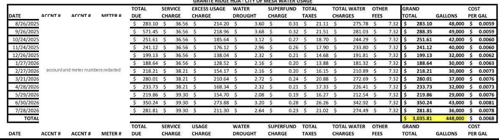
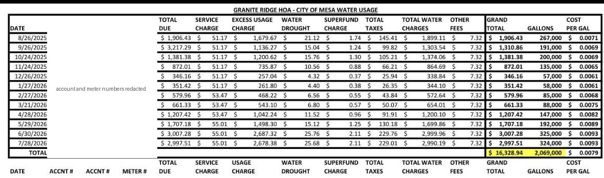
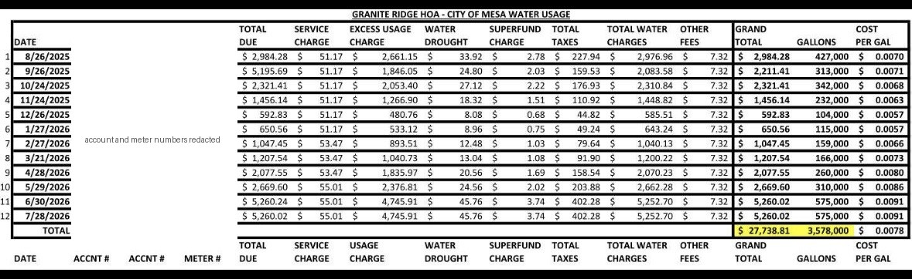
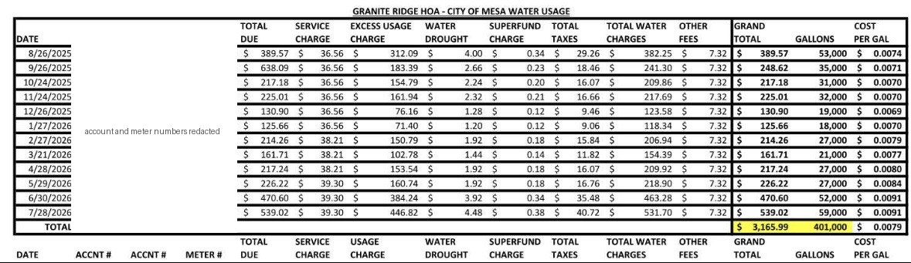

# City of Mesa water usage summary, August 2025 to July 2026

Every row carries billing account ...5714. Column names are as printed; the TOTAL row and the repeated header at the bottom of each table say "USAGE CHARGE" where the top header says "EXCESS USAGE CHARGE".

## Meter ...5793 (account ...8661, meter-4)

| Date | Total due | Service charge | Excess usage charge | Water drought | Superfund charge | Total taxes | Total water charges | Other fees | Grand total | Gallons | Cost per gal |
|---|---|---|---|---|---|---|---|---|---|---|---|
| 8/26/2025 | $283.10 | $36.56 | $214.20 | $3.60 | $0.31 | $21.11 | $275.78 | $7.32 | $283.10 | 48,000 | $0.0059 |
| 9/26/2025 | $571.45 | $36.56 | $218.96 | $3.68 | $0.32 | $21.51 | $281.03 | $7.32 | $288.35 | 49,000 | $0.0059 |
| 10/24/2025 | $251.61 | $36.56 | $185.64 | $3.12 | $0.27 | $18.70 | $244.29 | $7.32 | $251.61 | 42,000 | $0.0060 |
| 11/24/2025 | $241.12 | $36.56 | $176.12 | $2.96 | $0.26 | $17.90 | $233.80 | $7.32 | $241.12 | 40,000 | $0.0060 |
| 12/26/2025 | $199.13 | $36.56 | $138.04 | $2.32 | $0.21 | $14.68 | $191.81 | $7.32 | $199.13 | 32,000 | $0.0062 |
| 1/27/2026 | $188.64 | $36.56 | $128.52 | $2.16 | $0.20 | $13.88 | $181.32 | $7.32 | $188.64 | 30,000 | $0.0063 |
| 2/27/2026 | $218.21 | $38.21 | $154.17 | $2.16 | $0.20 | $16.15 | $210.89 | $7.32 | $218.21 | 30,000 | $0.0073 |
| 3/21/2026 | $280.01 | $38.21 | $210.64 | $2.72 | $0.24 | $20.88 | $272.69 | $7.32 | $280.01 | 37,000 | $0.0076 |
| 4/28/2026 | $233.73 | $38.21 | $168.34 | $2.32 | $0.21 | $17.33 | $226.41 | $7.32 | $233.73 | 32,000 | $0.0073 |
| 5/29/2026 | $219.86 | $39.30 | $154.70 | $2.08 | $0.19 | $16.27 | $212.54 | $7.32 | $219.86 | 29,000 | $0.0076 |
| 6/30/2026 | $350.24 | $39.30 | $273.88 | $3.20 | $0.28 | $26.26 | $342.92 | $7.32 | $350.24 | 43,000 | $0.0081 |
| 7/28/2026 | $281.81 | $39.30 | $211.30 | $2.64 | $0.23 | $21.02 | $274.49 | $7.32 | $281.81 | 36,000 | $0.0078 |
| TOTAL | | | | | | | | | $3,035.81 | 448,000 | $0.0068 |

## Meter ...4031 (account ...8671, meter-2)

| Date | Total due | Service charge | Excess usage charge | Water drought | Superfund charge | Total taxes | Total water charges | Other fees | Grand total | Gallons | Cost per gal |
|---|---|---|---|---|---|---|---|---|---|---|---|
| 8/26/2025 | $1,906.43 | $51.17 | $1,679.67 | $21.12 | $1.74 | $145.41 | $1,899.11 | $7.32 | $1,906.43 | 267,000 | $0.0071 |
| 9/26/2025 | $3,217.29 | $51.17 | $1,136.27 | $15.04 | $1.24 | $99.82 | $1,303.54 | $7.32 | $1,310.86 | 191,000 | $0.0069 |
| 10/24/2025 | $1,381.38 | $51.17 | $1,200.62 | $15.76 | $1.30 | $105.21 | $1,374.06 | $7.32 | $1,381.38 | 200,000 | $0.0069 |
| 11/24/2025 | $872.01 | $51.17 | $735.87 | $10.56 | $0.88 | $66.21 | $864.69 | $7.32 | $872.01 | 135,000 | $0.0065 |
| 12/26/2025 | $346.16 | $51.17 | $257.04 | $4.32 | $0.37 | $25.94 | $338.84 | $7.32 | $346.16 | 57,000 | $0.0061 |
| 1/27/2026 | $351.42 | $51.17 | $261.80 | $4.40 | $0.38 | $26.35 | $344.10 | $7.32 | $351.42 | 58,000 | $0.0061 |
| 2/27/2026 | $579.96 | $53.47 | $468.22 | $6.56 | $0.55 | $43.84 | $572.64 | $7.32 | $579.96 | 85,000 | $0.0068 |
| 3/21/2026 | $661.33 | $53.47 | $543.10 | $6.80 | $0.57 | $50.07 | $654.01 | $7.32 | $661.33 | 88,000 | $0.0075 |
| 4/28/2026 | $1,207.42 | $53.47 | $1,042.24 | $11.52 | $0.96 | $91.91 | $1,200.10 | $7.32 | $1,207.42 | 147,000 | $0.0082 |
| 5/29/2026 | $1,707.18 | $55.01 | $1,498.30 | $15.12 | $1.25 | $130.18 | $1,699.86 | $7.32 | $1,707.18 | 192,000 | $0.0089 |
| 6/30/2026 | $3,007.28 | $55.01 | $2,687.32 | $25.76 | $2.11 | $229.76 | $2,999.96 | $7.32 | $3,007.28 | 325,000 | $0.0093 |
| 7/28/2026 | $2,997.51 | $55.01 | $2,678.38 | $25.68 | $2.11 | $229.01 | $2,990.19 | $7.32 | $2,997.51 | 324,000 | $0.0093 |
| TOTAL | | | | | | | | | $16,328.94 | 2,069,000 | $0.0079 |

## Meter ...8300 (account ...8651, meter-1)

| Date | Total due | Service charge | Excess usage charge | Water drought | Superfund charge | Total taxes | Total water charges | Other fees | Grand total | Gallons | Cost per gal |
|---|---|---|---|---|---|---|---|---|---|---|---|
| 8/26/2025 | $2,984.28 | $51.17 | $2,661.15 | $33.92 | $2.78 | $227.94 | $2,976.96 | $7.32 | $2,984.28 | 427,000 | $0.0070 |
| 9/26/2025 | $5,195.69 | $51.17 | $1,846.05 | $24.80 | $2.03 | $159.53 | $2,083.58 | $7.32 | $2,211.41 | 313,000 | $0.0071 |
| 10/24/2025 | $2,321.41 | $51.17 | $2,053.40 | $27.12 | $2.22 | $176.93 | $2,310.84 | $7.32 | $2,321.41 | 342,000 | $0.0068 |
| 11/24/2025 | $1,456.14 | $51.17 | $1,266.90 | $18.32 | $1.51 | $110.92 | $1,448.82 | $7.32 | $1,456.14 | 232,000 | $0.0063 |
| 12/26/2025 | $592.83 | $51.17 | $480.76 | $8.08 | $0.68 | $44.82 | $585.51 | $7.32 | $592.83 | 104,000 | $0.0057 |
| 1/27/2026 | $650.56 | $51.17 | $533.12 | $8.96 | $0.75 | $49.24 | $643.24 | $7.32 | $650.56 | 115,000 | $0.0057 |
| 2/27/2026 | $1,047.45 | $53.47 | $893.51 | $12.48 | $1.03 | $79.64 | $1,040.13 | $7.32 | $1,047.45 | 159,000 | $0.0066 |
| 3/21/2026 | $1,207.54 | $53.47 | $1,040.73 | $13.04 | $1.08 | $91.90 | $1,200.22 | $7.32 | $1,207.54 | 166,000 | $0.0073 |
| 4/28/2026 | $2,077.55 | $53.47 | $1,835.97 | $20.56 | $1.69 | $158.54 | $2,070.23 | $7.32 | $2,077.55 | 260,000 | $0.0080 |
| 5/29/2026 | $2,669.60 | $55.01 | $2,376.81 | $24.56 | $2.02 | $203.88 | $2,662.28 | $7.32 | $2,669.60 | 310,000 | $0.0086 |
| 6/30/2026 | $5,260.24 | $55.01 | $4,745.91 | $45.76 | $3.74 | $402.28 | $5,252.70 | $7.32 | $5,260.02 | 575,000 | $0.0091 |
| 7/28/2026 | $5,260.02 | $55.01 | $4,745.91 | $45.76 | $3.74 | $402.28 | $5,252.70 | $7.32 | $5,260.02 | 575,000 | $0.0091 |
| TOTAL | | | | | | | | | $27,738.81 | 3,578,000 | $0.0078 |

## Meter ...4706 (account ...8681, meter-3)

| Date | Total due | Service charge | Excess usage charge | Water drought | Superfund charge | Total taxes | Total water charges | Other fees | Grand total | Gallons | Cost per gal |
|---|---|---|---|---|---|---|---|---|---|---|---|
| 8/26/2025 | $389.57 | $36.56 | $312.09 | $4.00 | $0.34 | $29.26 | $382.25 | $7.32 | $389.57 | 53,000 | $0.0074 |
| 9/26/2025 | $638.09 | $36.56 | $183.39 | $2.66 | $0.23 | $18.46 | $241.30 | $7.32 | $248.62 | 35,000 | $0.0071 |
| 10/24/2025 | $217.18 | $36.56 | $154.79 | $2.24 | $0.20 | $16.07 | $209.86 | $7.32 | $217.18 | 31,000 | $0.0070 |
| 11/24/2025 | $225.01 | $36.56 | $161.94 | $2.32 | $0.21 | $16.66 | $217.69 | $7.32 | $225.01 | 32,000 | $0.0070 |
| 12/26/2025 | $130.90 | $36.56 | $76.16 | $1.28 | $0.12 | $9.46 | $123.58 | $7.32 | $130.90 | 19,000 | $0.0069 |
| 1/27/2026 | $125.66 | $36.56 | $71.40 | $1.20 | $0.12 | $9.06 | $118.34 | $7.32 | $125.66 | 18,000 | $0.0070 |
| 2/27/2026 | $214.26 | $38.21 | $150.79 | $1.92 | $0.18 | $15.84 | $206.94 | $7.32 | $214.26 | 27,000 | $0.0079 |
| 3/21/2026 | $161.71 | $38.21 | $102.78 | $1.44 | $0.14 | $11.82 | $154.39 | $7.32 | $161.71 | 21,000 | $0.0077 |
| 4/28/2026 | $217.24 | $38.21 | $153.54 | $1.92 | $0.18 | $16.07 | $209.92 | $7.32 | $217.24 | 27,000 | $0.0080 |
| 5/29/2026 | $226.22 | $39.30 | $160.74 | $1.92 | $0.18 | $16.76 | $218.90 | $7.32 | $226.22 | 27,000 | $0.0084 |
| 6/30/2026 | $470.60 | $39.30 | $384.24 | $3.92 | $0.34 | $35.48 | $463.28 | $7.32 | $470.60 | 52,000 | $0.0091 |
| 7/28/2026 | $539.02 | $39.30 | $446.82 | $4.48 | $0.38 | $40.72 | $531.70 | $7.32 | $539.02 | 59,000 | $0.0091 |
| TOTAL | | | | | | | | | $3,165.99 | 401,000 | $0.0079 |

## Rows that do not add up

| Meter | Date | Issue |
|---|---|---|
| ...8300 | 9/26/2025 | Grand total $2,211.41 is $120.51 more than Total Water Charges plus Other Fees ($2,090.90). |
| ...8300 | 10/24/2025 | Grand total $2,321.41 is $3.25 more than Total Water Charges plus Other Fees ($2,318.16). |
| ...4706 | 9/26/2025 | Water drought $2.66; the $0.08 per thousand gallons above 3,000 pattern on every other row gives $2.56. Columns still add to the listed total. |
| ...8300 | 6/30/2026 | Total due $5,260.24 is $0.22 more than the grand total $5,260.02. |

On the 9/26/2025 rows of all four meters, Total due equals the 8/26/2025 grand total plus the 9/26/2025 grand total (a carried balance).
