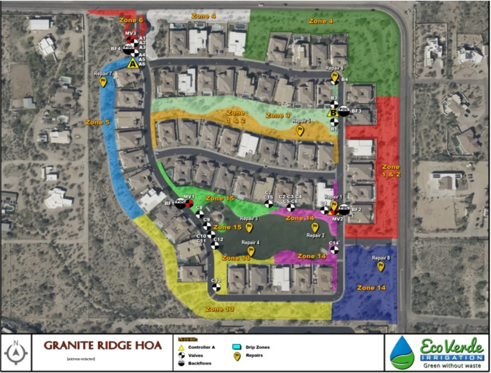

# Eco Verde irrigation assessment, 2026

Full site assessment by Eco Verde Irrigation for the Granite Ridge HOA. Assessment meeting 2026-02-16. Controller settings were printed on 2026-03-29. The landscape contractor named on the controller reports is Schnepf Landscape Co.

## Page 3: Maps of assessed areas

Legend: Controller (yellow triangle), Valves (checkered circle), Backflows, Drip Zones (colored areas), Repairs (yellow flag). What the map shows:

| Marker | Location on the map |
|---|---|
| Controller A, master valve MV3, backflow BF4, point of connection (POC), valves A1 to A6 | Northwest entry gate off McKellips |
| Controller B, backflow BF3, POC, valves B1, B3, B4 | East street, at the east end of the interior strip |
| Master valve MV1, backflow BF1, POC, valves C8 to C13 | West side of the park, on the curving west street |
| Controller C, master valve MV2, backflow BF2, POC, valves C1 to C7, C14, C15 | East side of the park, on the east street |

| Drip zone label | Color | Where |
|---|---|---|
| Zone 6 | red | At the entry gate |
| Zone 4 | white | Strip along McKellips just east of the entry |
| Zone 4 | dark green | Northeast corner along McKellips and Crismon |
| Zone 5 | blue | West edge (west wash), from the entry south to the park |
| Zone 1 & 2 | orange | Interior strip, south half |
| Zone 3 | light green | Interior strip, north half |
| Zone 1 & 2 | red | East edge along Crismon |
| Zone 15 | bright green | North side of the park and the park interior near the playground |
| Zone 14 | magenta | East and south edges of the park turf |
| Zone 14 | dark blue | Southeast corner desert along Crismon |
| Zone 13 | yellow | South and southwest desert, and the southwest edge of the park |

Repairs 1 to 8 are flagged on the map: 1 at MV2 (east park), 2, 3, and 4 in the park turf, 5 in Zone 3 (interior strip), 6 at valve B4, 7 in Zone 5 (west wash), 8 in the southeast Zone 14.

The map labels Zone 4 twice and Zone 1 & 2 twice. Which controller runs each colored zone is not printed; see the notes at the end.

## Page 4: Current controller programming, Entrance controller (settings of 2026-03-29)

Controller Settings Detail Report, controller ending 6094, "Granite Ridge Entrance".

Days/Times configuration:

| Program | Name | Mainline | Pump start | Window 1 start | Window 1 duration | Window 1 end | Window 2 mode | Window 2 start | Window 2 duration | Window 2 end | Water days | Options |
|---|---|---|---|---|---|---|---|---|---|---|---|---|
| A | Grass | Mainline 1 | Excluded | 12:00AM | 07:00 | 7:00AM | Off | 7:00PM | 05:00 | 12:00AM | Days of week | Sun, Tue, Thu, Fri |
| B | Drip | Mainline 1 | Excluded | 10:00PM | 06:00 | 4:00AM | Off | 7:00PM | 05:00 | 12:00AM | Days of week | Sun, Thu |
| C | Program C | | Excluded | 12:00AM | 16:00 | 4:00PM | Off | 7:00PM | 05:00 | 12:00AM | Off | |
| D | Program D | | Excluded | 12:00AM | 16:00 | 4:00PM | Off | 7:00PM | 05:00 | 12:00AM | Off | |

The Options column prints one letter per day from Sunday to Saturday with a dash for each off day. Program A prints S, dash, T, dash, T, F, dash; Program B prints S, dash, dash, dash, T, dash, dash. Read by position, A waters Sunday, Tuesday, Thursday, and Friday, and B waters Sunday and Thursday.

Station configuration, Auto mode: no stations.

Station configuration, User mode:

| Station | Name | Program | Mode | Run time (min) | Cycles | Soak (min) | Use water window | Usable rainfall | Reference ET | Pct adj | Reference month |
|---|---|---|---|---|---|---|---|---|---|---|---|
| 1 | Pop-up - East 180 | A | User ET | 4.0 | 2 | 120 | Yes | 100% | 1.50 | 0% | Jan |
| 2 | Pop-up - West 180 | A | User ET | 5.0 | 2 | 120 | Yes | 100% | 1.50 | 0% | Jan |
| 3 | Pop-up - West 360 | A | User ET | 5.0 | 2 | 120 | Yes | 100% | 1.50 | 0% | Jan |
| 4 | Drip - Entrance | B | User ET | 50.0 | 1 | 30 | Yes | 100% | 2.00 | 0% | Sep |
| 6 | Drip - Entrance | B | User ET | 50.0 | 1 | 30 | Yes | 100% | 2.00 | 0% | Sep |

Station configuration, Off mode: station 5, "Drip West Wash area OFF".

Custom crop coefficients: Custom Plant A 1.00 and Custom Plant B 1.00 (all months); Custom Turf 1.00 every month, January to December.

## Page 5: Park controller station flow rates (settings of 2026-03-29)

Controller Settings Detail Report, controller ending 6637, "Granite Ridge Park", page 3 of 9 of that report (the other 8 pages, including the park run times, are not in this PDF). Station Flow Rates and Thresholds for Station High Flow Alerts. User Defined flow and User Defined threshold are 0.0 on every row; the high flow offset is 20% on every row.

| Station | Name | Sprinkler type (as set) | Learned flow date | Learned flow (GPM) | Assigned flow (GPM) | High flow offset (GPM) | High flow threshold (GPM) |
|---|---|---|---|---|---|---|---|
| 1 | NE sidewalk 180 | Spray Head | 2024-08-15 10:42 AM | 61.0 | 61.0 | 12.0 | 73.0 |
| 2 | SE curb 180 | Spray Head | 2024-08-15 10:45 AM | 58.0 | 58.0 | 12.0 | 70.0 |
| 3 | SE middle-south 360 | Spray Head | 2024-08-15 10:48 AM | 41.0 | 41.0 | 8.0 | 49.0 |
| 4 | SE middle-center 360 | Spray Head | 2025-07-25 9:43 PM | 71.0 | 71.0 | 14.0 | 85.0 |
| 5 | NE middle-center 360 | Spray Head | 2024-08-15 10:54 AM | 74.0 | 74.0 | 15.0 | 89.0 |
| 6 | NE middle-north 360 | Spray Head | 2024-08-15 10:57 AM | 67.0 | 67.0 | 13.0 | 80.0 |
| 7 | N sidewalk center 180 | Spray Head | 2024-08-15 11:00 AM | 63.0 | 63.0 | 13.0 | 76.0 |
| 8 | W of playground 180 | Spray Head | 2024-10-31 9:23 AM | 61.0 | 61.0 | 12.0 | 73.0 |
| 9 | Ramada curb 180 | Spray Head | 2024-08-20 10:06 AM | 57.0 | 57.0 | 11.0 | 68.0 |
| 10 | NW center 360 | Spray Head | 2024-08-20 10:09 AM | 54.0 | 54.0 | 11.0 | 65.0 |
| 11 | SW center 360 | Spray Head | 2024-08-20 10:12 AM | 59.0 | 59.0 | 12.0 | 71.0 |
| 12 | SW curb 180 | Spray Head | 2024-08-20 10:15 AM | 50.0 | 50.0 | 10.0 | 60.0 |
| 13 | Drip | Spray Head | 2024-08-20 10:18 AM | 41.0 | 41.0 | 8.0 | 49.0 |
| 14 | Drip | Spray Head | 2025-07-25 9:47 PM | 28.0 | 28.0 | 6.0 | 34.0 |
| 15 | Drip | Spray Head | 2024-08-14 1:57 PM | 11.0 | 11.0 | 2.0 | 13.0 |

Stations 16 to 29 are listed with no learned flow (0.0).

## Page 6: Park irrigation versus ET

Chart "Measured Usage per Day: Granite Ridge Park", 2026-02-28 to 2026-03-29 (Single Controller Measured Usage History Report). Bars are daily gallons by irrigation category (Scheduled, Manual, Other, None); the line is daily ET in inches. Read by eye: watering on about 18 of 30 days, most watering days between about 17,000 and 29,000 gallons, the largest about 32,000 on 2026-03-10 (including about 6,500 manual). Manual watering also on 2026-03-03 (about 1,700). Daily ET rises from about 0.15 to 0.27 inches. No values are printed, so these readings are approximate and are not used as data.

## Section 3: Irrigation enhancement recommendations (pages 7 to 13)

**3a. Controllers, issue.** Most irrigation is run by two WeatherTRAK smart controllers. The Entrance controller is a WeatherTRAK LC+ with five active stations: three irrigate the turfgrass east and west of the entrance and two irrigate the trees and shrubs along McKellips. The Park controller is a WeatherTRAK ETPRO3 with 15 active zones: 12 irrigate turfgrass and 3 irrigate the trees and shrubs around the turf. The Park controller has a wireless Irritrol rain sensor, which the factory can also set up to affect the Entrance controller. Both controllers include master valves and flow sensors. All stations run in "User ET" mode: the contractor sets the program and the controller adjusts it daily for weather.

**3b. Controllers, solution.** Move stations to "Auto" mode, which needs sprinkler type, soil type, plant type, root depth, microclimate, and slope programmed per station. Quote: "Eco Verde Irrigation has seen actual water savings of up to 30% with WeatherTRAK controllers operating in the fully Auto mode."

**3c. Incentives.** None from the City of Mesa for moving from User ET to Auto mode.

**3d. Sprayheads, issues.** "The only sprayheads on the property irrigate small turf areas on either side of the McKellips entrance." Typical distribution uniformity for these sprayheads is about 40%; overwatering by as much as 156% may be needed to prevent dry spots. Issue 1: precipitation rate about 1.5 inches per hour, causing runoff. Issue 2: nozzles cataloged to 30 psi are running at 45 psi (misting, drift). Issue 3: low-head drainage at the bottom of slopes. Issue 4: cycle and soak doubles the low-head drainage.

**3e. Sprayheads, solutions.** Hunter PROS-04-PRS40 bodies (pressure regulated to 40 psi); PROS-04-PRS40-CV bodies with check valves at the bottom of slopes; Hunter SJ-506 swing joints; Hunter MP Rotator nozzles "to almost double the efficiency"; reinstate cycle and soak after check valves are in.

**3f. Incentives.** City of Mesa reimburses 50% of the wholesale price of pressure regulating bodies and high-efficiency nozzles with an approved application (minimum 20 of each).

**3g. Rotors, issues.** Larger turf areas use Hunter and Rain Bird rotors. Some are not nozzled for matched precipitation rate. Example, valve C7: all heads are half circles but nozzle sizes are 8, 15, 8, 6, 10, 10, and 10. Some nozzle retainer screws are turned in too far, diffusing the pattern. Some rotors overspray onto hardscape.

**3h. Rotors, solutions.** Eco Verde will train the landscape contractor to nozzle for matched precipitation, adjust retainer screws, and adjust rotors to cut overspray. (The report says "Heritage Pointe" in this paragraph; it appears to be a copy error from another report.)

**3i. Incentives.** None for these items.

**3j. Drip emitters, issue.** An agronomic issue, not an efficiency issue: emitters sit at the base of mature trees, which is not good for long-term tree health.

**3k. Drip emitters, solution.** Move emitters to the canopy edge (dripline), add emitters by tree size and type, "or eliminate drip irrigation from mature native trees that may no longer require irrigation."

**3l. Incentives.** None for moving emitters.

## Section 4: Recommended repairs (pages 13 to 15)

Repairs 7 and 8 are on the page 3 map but not addressed: "Repair 7 is in an area not currently being irrigated and repair 8 is in a protected area."

| Repair | What | Where (from the maps) |
|---|---|---|
| 1 | Master valve leak (photo: valve box with standing water) | MV2, east side of the park |
| 2, 3, 4 | Bad wiper seals (rotor spraying water at the base) | Park turf |
| 5 | Broken lateral line | Zone 3, interior strip |
| 6 | Valve not activated by controller | Valve B4, east street north of controller B |

Not on the maps: "orphan" emitters that need goof plugs, a valve box with excess debris, relocate the wireless rain sensor for better exposure to rain, and adjust one rotor to full circle to fix a dry spot.

## Section 5: Current irrigation system information (pages 16 to 19)

Backflow devices pictured: front entrance, west end park, east end park, native walkway.

* Reduced pressure assemblies: No. Pressure vacuum breakers: Yes. Manufacturer Febco, model 765. "Backflows #1 & #2 are 1-1/2" devices, backflows #3 & #4 are 1" devices." Installed per code: Yes. Dynamic pressure: no issues observed. Annual certification should be verified.
* Control valves: Hunter ICV, Rain Bird PEB, Irritrol 200 series and 2500.
* Drip manifolds: Rain Bird PEB and Irritrol 2500 valves, Jain filter, Senninger pressure regulator. "Do valves irrigate hydrozones? No."
* Rotors: Hunter I25, Hunter I20, Rain Bird 5004, Rain Bird 5504. Pressure 40 psi. Nozzled for matched precipitation rate: No.
* Sprayheads: Hunter PROS-04. Nozzles: Rain Bird, mostly old variable arc (VAN). Pressure 45 psi.

## Summary (page 20)

Recommendations in priority order: 3b (controllers to Auto mode), 3e and 3f (sprayhead bodies, check valves, MP Rotator nozzles, with the City incentive), 3h (rotor nozzling and adjustment), 3k (move tree emitters).

## City of Mesa Landscape Irrigation Equipment Incentives (page 21, as printed in the report)

Funding is limited and not guaranteed. Not retroactive before the approval date; projects done without Mesa approval do not qualify. Waterfluence is free for HOAs.

| Item | Incentive as printed |
|---|---|
| WaterSense smart controller | 50% of wholesale price, up to $2,000 each |
| Qualified installation of WaterSense smart controller | 50% of cost, up to $250 each |
| High efficiency nozzles | 50% of wholesale price, minimum of 20 nozzles |
| Pressure regulating spray sprinkler bodies | 50% of wholesale price, minimum of 20 bodies |
| Valve pressure regulator | 50% of wholesale price, up to $100, irrigation system only |
| Flow sensor for smart controller | 50% of wholesale price, up to $1,000 each |
| Qualified installation of flow sensor for smart controller | 50% of cost, up to $500 each |
| Rain sensor | 50% of wholesale price, up to $100 each |

## Conclusion (page 22)

The HOA is encouraged to use City incentives and "to further explore turf reduction in the Park area and to develop contingency plans for turf reduction" in case of future shortages, higher rates, or restrictions. (Turf reduction is out of scope for this project for now.)

## Notes from this transcription (not in the report)

* **Meters.** The four points of connection match the four meter pins on the Waterfluence Controller Map: entry gate (meter-3), east end of the interior strip (meter-4), west side of the park (meter-2), east side of the park (meter-1). The backflow sizes agree with the meter sizes in Jennifer's workbook if the report's backflows #1 and #2 are the two park devices (1.5 inch, like meter-1 and meter-2) and #3 and #4 are the entrance and the "native walkway" by controller B (1 inch, like meter-3 and meter-4). The report numbers the photos in a different order (front entrance first), so this match is an inference.
* **Controller B** (meter-4) is not a WeatherTRAK controller: the report says two WeatherTRAK controllers do most of the watering, and the 2025 HydroPoint reports list only the Entrance and Park controllers. Its make, settings, and whether it has a flow sensor are unknown.
* **Drip zone numbers** appear to be station numbers. Zones 13, 14, and 15 match the park controller's three drip stations (13, 14, 15). Zones 4, 5, and 6 match the Entrance drip stations 4, 5 (off, "West Wash", where repair 7 is "not currently being irrigated"), and 6. Zones 1 & 2 and 3 are near controller B. The green northeast Zone 4 sits at valve B4, so it is probably controller B's station 4, and the white Zone 4 is probably the Entrance station 4. Not confirmed.
* **Entrance turf.** Jennifer reported on 2026-10-07 that the entrance turf has been replaced with artificial turf. Entrance stations 1 to 3 were the turf stations and the only sprayheads on the property, so recommendations 3d to 3f no longer apply unless those heads were kept for something else.
* **Park station types.** All 15 park stations are set as "Spray Head" in the controller, but the report says the park turf uses rotors and stations 13 to 15 are drip. In User ET mode this setting does not change run times; it would matter in Auto mode.
