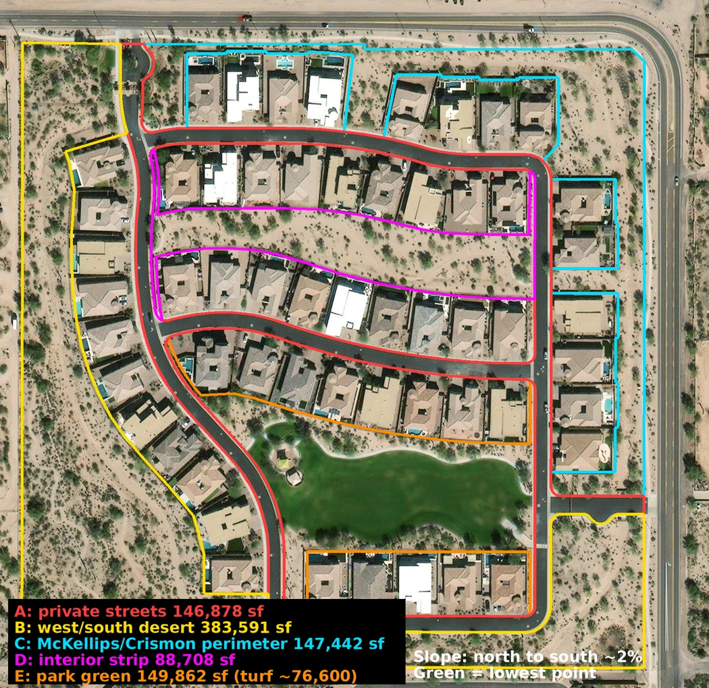

# Common-area map

Transcription of the map legend and notes:

| Label | Area | Square feet | Outline color |
|---|---|---|---|
| A | Private streets | 146,878 | red |
| B | West/south desert | 383,591 | yellow |
| C | McKellips/Crismon perimeter | 147,442 | blue |
| D | Interior strip | 88,708 | magenta |
| E | Park green (turf ~76,600) | 149,862 | orange |

Notes on the map: "Slope: north to south ~2%". "Green = lowest point".

The areas include no homeowner lot area (Jennifer, 2026-10-06). These figures are in `data/areas.md`.
