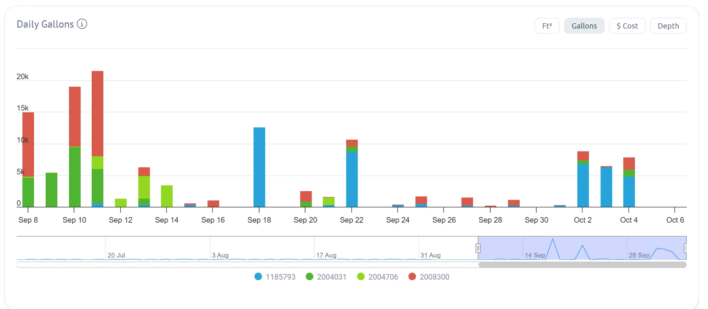

# Waterfluence daily chart, September 8 to October 6, 2026

Stacked daily gallons per meter. Legend, by meter number last 4: ...5793 (blue, meter-4), ...4031 (dark green, meter-2), ...4706 (light green, meter-3), ...8300 (red, meter-1). The image itself shows full meter numbers.

Values below were read by eye and are approximate. They are not used as data; exact numbers come from AMI exports.

## Check against the AMI export (overlapping days)

| Date | Chart (by eye) | AMI export (`data/usage/`) |
|---|---|---|
| 2026-09-10 | meter-2 about 9,500; meter-1 about 9,500 | meter-2 9,440; meter-1 9,483 |
| 2026-09-18 | meter-4 about 12,600 | meter-4 12,626 |
| 2026-09-22 | meter-4 about 8,800, small meter-2 and meter-1 | meter-4 8,759; meter-2 801; meter-1 1,111 |

The chart and the export agree.

## New days not yet in any export (read by eye)

| Date | Meter-4 (blue) | Other meters |
|---|---|---|
| 2026-10-02 | about 6,800 | meter-1 about 1,400, meter-2 about 500 |
| 2026-10-03 | about 6,300 | meter-1 about 200 |
| 2026-10-04 | about 4,800 | meter-2 about 1,100, meter-1 about 1,900 |

## What it shows

* Meter-4 normally uses about 75 gallons a day (median, July 3 to September 7). From September 18 it has several days of 5,000 to 12,600 gallons.
* Meter-1 and meter-2 dropped to near zero after September 12, which fits fall overseed preparation, but that is not confirmed.
