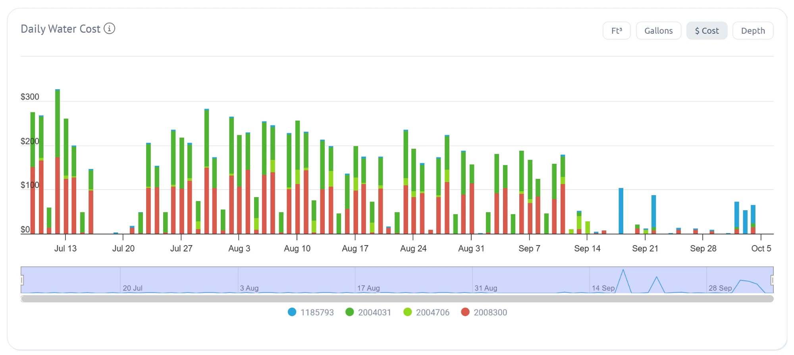

# Waterfluence daily cost, July to October 2026

Stacked daily dollars per meter, as calculated by Waterfluence (not City of Mesa bills). Colors: blue ...5793 (meter-4), dark green ...4031 (meter-2), light green ...4706 (meter-3), red ...8300 (meter-1).

Read by eye (approximate, not used as data):

* July and August irrigation days mostly cost $150 to $280 a day, peaking at about $330 around July 12. Meter-1 and meter-2 make up almost all of it.
* From mid-September, meter-1 and meter-2 drop to near zero and meter-4 appears: about $103 on 2026-09-18 (12,626 gallons that day per the AMI export), about $86 on 2026-09-22 (8,759 gallons), and about $50 to $70 a day on 2026-10-02 to 10-04.

Waterfluence's cost method (which rates and fees it uses) is unknown. It cannot replace bills until checked against at least one bill.
