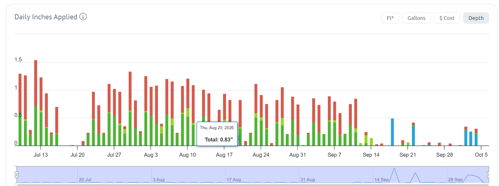

# Waterfluence daily inches applied, July to October 2026

Inches of water applied per day, stacked by meter (same colors as the other charts). Waterfluence converts gallons to inches using the irrigated area it has on file for each meter, so it already holds an irrigated square footage per meter.

## Exact values shown (tooltip)

| Date | Total inches applied |
|---|---|
| 2026-08-20 | 0.83 |

For reference, AMI gallons that day: meter-1 10,006.7; meter-2 7,420; meter-3 813.8 (18 hours reported); meter-4 376.

## Read by eye (approximate)

* July and August watering days apply about 0.8 to 1.5 inches in total, most of it on meter-1 (red).
* Meter-4 (blue) applied about 0.5 inches on 2026-09-18, about 0.35 on 09-22, and about 0.25 to 0.3 a day on 10-03 to 10-05.
