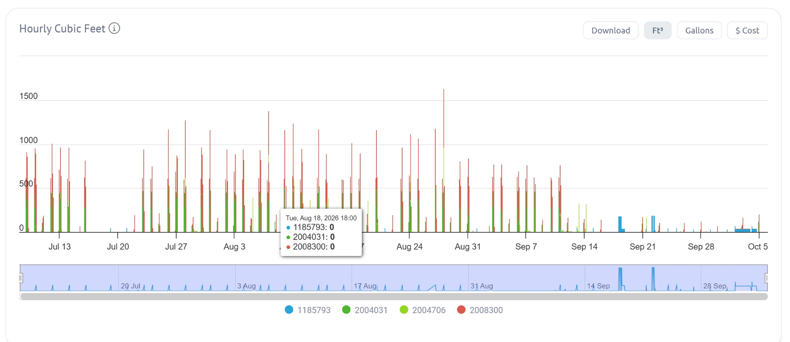
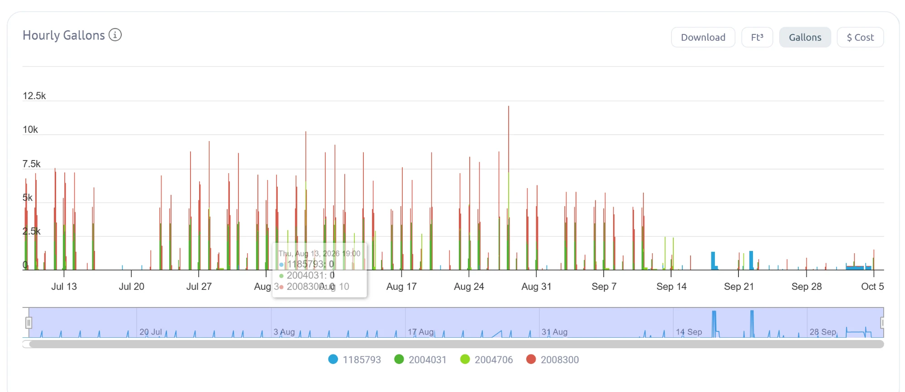

# Waterfluence hourly charts, July to October 2026

Same hourly data as the AMI export, shown in cubic feet and in gallons. The exact numbers are in `ami-hourly-meter-*-2026.md`, so nothing here is read by eye.

Tooltips shown: Tue Aug 18, 2026 18:00, all meters 0 cubic feet. Thu Aug 13, 2026 19:00, meters ...5793, ...4031, ...8300 all 0 gallons.

What the charts show: watering on meter-1 and meter-2 every few days through mid-September in short tall spikes (normal scheduled cycles), then a long flat block on meter-4 from October 2 to October 4 (the steady flow recorded in flag `2026-09-meter-4-step-change`).

The dashboard has a Download button on this view, which is how the AMI exports were made.
