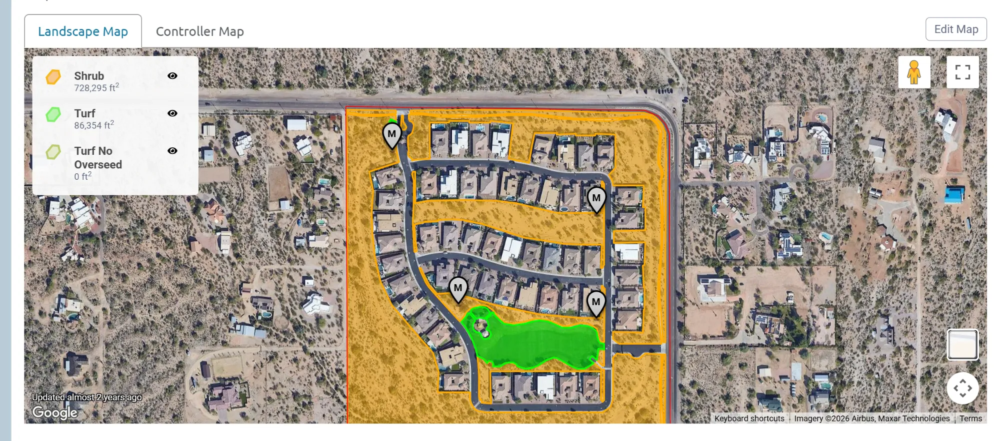
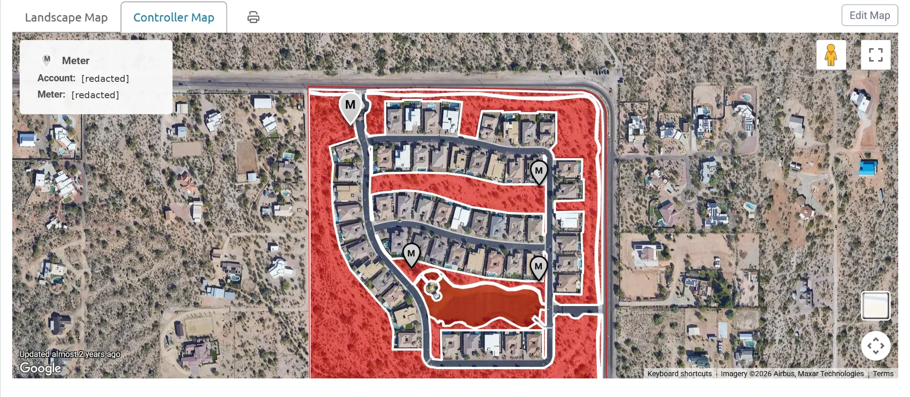
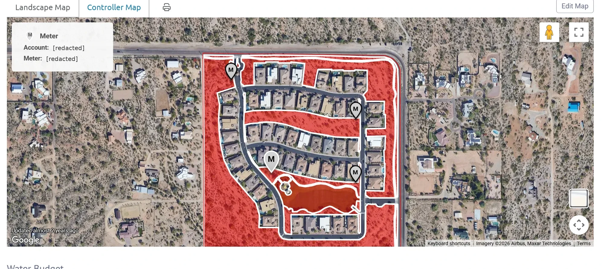
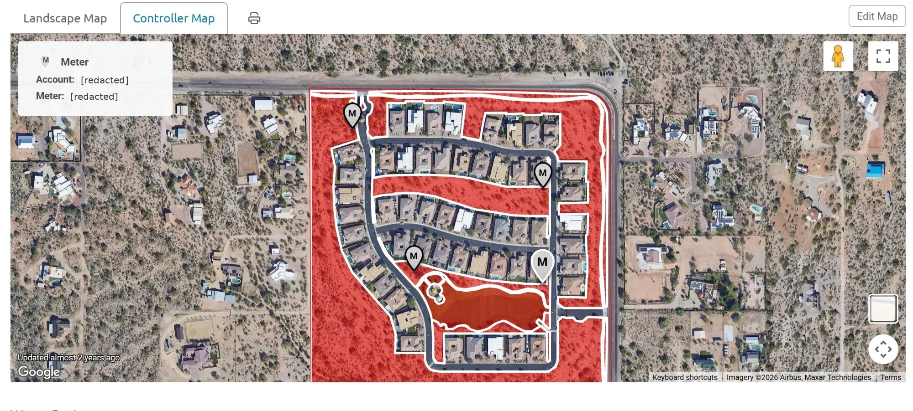

# Waterfluence landscape and controller maps

Satellite imagery in these screenshots is Google, Airbus, and Maxar. The images stay in this private folder and are not used on the website; the website uses a traced schematic (`data/map.md`).

## Landscape Map

Legend, transcribed exactly:

| Landscape type | Area |
|---|---|
| Shrub | 728,295 ft2 |
| Turf | 86,354 ft2 |
| Turf No Overseed | 0 ft2 |

Shrub (orange) covers all the desert common areas: the west and south desert, the McKellips and Crismon perimeter, the interior strip, and the non-turf parts of the park. Turf (green) is the park lawn only. Four meter pins (M) are shown.

## Controller Map, one screenshot per meter

Each screenshot highlights one meter pin (drawn larger) and lists its account and meter number. The whole landscape is shaded the same in every screenshot, so these maps show where each meter is, not which areas it waters.

| Screenshot | Mesa account (last 4) | Meter number (last 4) | Meter label | Highlighted pin location |
|---|---|---|---|---|
|  | 8681 (printed ...868-1) | 4706 | meter-3 | Northwest corner, at the entry gate off McKellips Road |
|  | 8661 (printed ...866-1) | 5793 | meter-4 | East side, west of the east street, at the east end of the interior strip |
|  | 8671 (printed ...867-1) | 4031 | meter-2 | West side, at the northwest corner of the park, east of the curving west street |
|  | 8651 (printed ...865-1) | 8300 | meter-1 | East side, at the northeast corner of the park, west of the east street |

The four accounts are separate and numbered consecutively.

## Comparison with Jennifer's area map

| Measure | Waterfluence | Jennifer's map (`data/areas.md`) |
|---|---|---|
| Turf | 86,354 ft2 | about 76,600 ft2 |
| Shrub plus turf | 814,649 ft2 | 769,603 ft2 (areas B to E, excluding streets) |

Waterfluence is about 13% higher for turf and about 6% higher overall. Which one the water budget uses is an open question.
