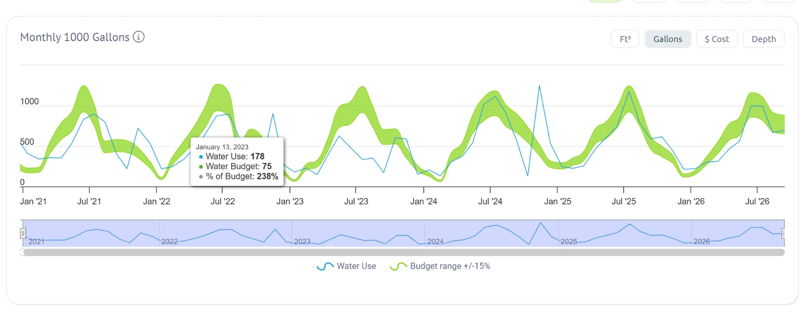

# Waterfluence monthly use vs budget, 2021 to 2026

All 4 meters combined, thousand gallons per month. Blue line is water use; green band is Waterfluence's water budget +/-15%.

## Exact values shown (tooltip)

| Point | Water use | Water budget | % of budget |
|---|---|---|---|
| January 13, 2023 | 178 | 75 | 238% |

## Check against the ENERGY STAR export

Where the chart overlaps the export (September 2023 on), it matches: summer 2024 peak about 1,130 on the chart vs 1,117 exported (2024-06-14 to 07-15); fall 2023 about 600 vs 601 and 590.

## Read by eye (approximate, not used as data)

| Summer peak month | Water use | Budget band (approx) |
|---|---|---|
| Jul 2021 | about 900 | about 900 to 1,250 |
| Jul 2022 | about 880 to 900 | about 950 to 1,300 |
| Jul 2023 | about 630 | about 900 to 1,250 |
| Jul 2024 | about 1,130 (exact 1,117) | about 880 to 1,200 |
| Jul 2025 | about 1,200 (exact 1,178) | about 920 to 1,250 |
| Jul 2026 | about 1,000 (exact 994 and 995) | about 860 to 1,180 |

| Fall or winter spike | Water use | Budget band (approx) |
|---|---|---|
| Nov 2021 | about 720 | about 450 to 600 |
| Nov 2022 | about 900 | about 550 to 700 |
| Oct 2023 | about 600 (exact 601) | about 500 to 600 |
| Nov 2024 | about 1,270 (exact 1,249) | about 400 to 500 |

## What it shows

* 2021 to 2023 summers ran well below the Waterfluence budget. Summer 2023 was the lowest of all years, which matches the low 2023 P&L water cost ($26,016.31).
* From 2024 on, summer use rose to the budget level, about 25% to 30% above 2021 and 2022 summers and about 80% above summer 2023.
* Every fall or winter has a spike above budget, which lines up with overseeding. The November 2024 spike is the largest.
* The 2023 to 2024 cost jump is therefore mostly more summer water plus the November 2024 spike, on top of any rate increases (still unconfirmed until rates are in).
