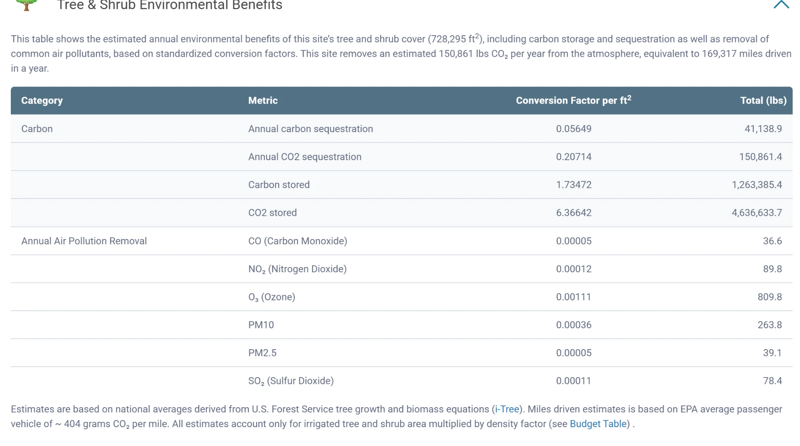

# Waterfluence tree and shrub environmental benefits

Full transcription.

"This table shows the estimated annual environmental benefits of this site's tree and shrub cover (728,295 ft2), including carbon storage and sequestration as well as removal of common air pollutants, based on standardized conversion factors. This site removes an estimated 150,861 lbs CO2 per year from the atmosphere, equivalent to 169,317 miles driven in a year."

| Category | Metric | Conversion factor per ft2 | Total (lbs) |
|---|---|---|---|
| Carbon | Annual carbon sequestration | 0.05649 | 41,138.9 |
| | Annual CO2 sequestration | 0.20714 | 150,861.4 |
| | Carbon stored | 1.73472 | 1,263,385.4 |
| | CO2 stored | 6.36642 | 4,636,633.7 |
| Annual Air Pollution Removal | CO (Carbon Monoxide) | 0.00005 | 36.6 |
| | NO2 (Nitrogen Dioxide) | 0.00012 | 89.8 |
| | O3 (Ozone) | 0.00111 | 809.8 |
| | PM10 | 0.00036 | 263.8 |
| | PM2.5 | 0.00005 | 39.1 |
| | SO2 (Sulfur Dioxide) | 0.00011 | 78.4 |

"Estimates are based on national averages derived from U.S. Forest Service tree growth and biomass equations (i-Tree). Miles driven estimates is based on EPA average passenger vehicle of ~ 404 grams CO2 per mile. All estimates account only for irrigated tree and shrub area multiplied by density factor (see Budget Table)."

## Why it matters for the model

* Waterfluence has a site "Budget Table" with irrigated tree and shrub area and a density factor. That table is the input the water budget needs (Phase 2).
* 728,295 ft2 is irrigated tree and shrub area times a density factor, so it is not the same as gross irrigated area. For comparison, the map's non-street common area is 769,603 ft2 (areas B to E). Not used as data until the Budget Table is in hand.
